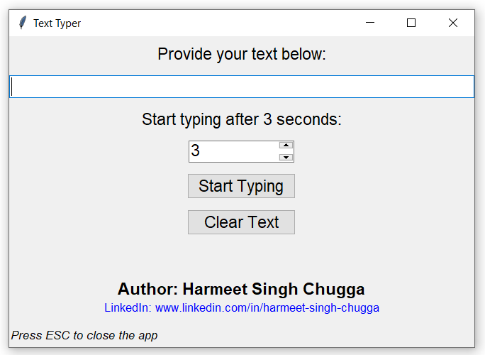

# ⌨️ Text Typer

A simple **cross-platform GUI app** built with **Python + Tkinter** that types your provided text automatically after a specified delay.**Tkinter** is opensource, We can freely build and sell applications made with Tkinter — no royalties or special permissions required.The app uses **PyAutoGUI** to type the text.

---
## 🚀 Features
- 🧭 Cross-platform (works on **Windows**, **Linux**, and **macOS**)
- ✍️ Automatically types user provided text after user-specified  delay.
---

## 🖼️ Screenshot

  
  <br>
  <em>Image: Text Typer App Interface</em>

## 🧩 Requirements
Make sure you have **Python** installed. This app was build using **python 3.12.8**.

Then install dependencies:

```bash
pip install -r requirements.txt
```

Tkinter usually comes pre-installed with Python.
If missing (on Linux) , then install using:  
```bash
 sudo apt install python3-tk
``` 

---
## 🖥️ How to Run

1. Clone this repository:
   ```bash
   git clone https://github.com/harmeet773/text-typer.git
   cd text-typer
   ```

2. Run the app:
   ```bash
   python text-typer.py
   ```

3. Provide the text you want to type 

4. Then click on **Start Typing**

5. Switch to the text window where you want the text to be typed.

---

## 🏗️ Build Standalone Executables

🔹 Run below commands in the project folder
```bash
pip install pyinstaller
pyinstaller --onefile --windowed text-typer.py
```
executable file will be created in the `dist/` folder


---
## 🧑Author

**Harmeet Singh**  
[LinkedIn](https://www.linkedin.com/in/harmeet-singh-chugga)

---

## 🪪 License

This project is licensed under the [MIT License](LICENSE).
